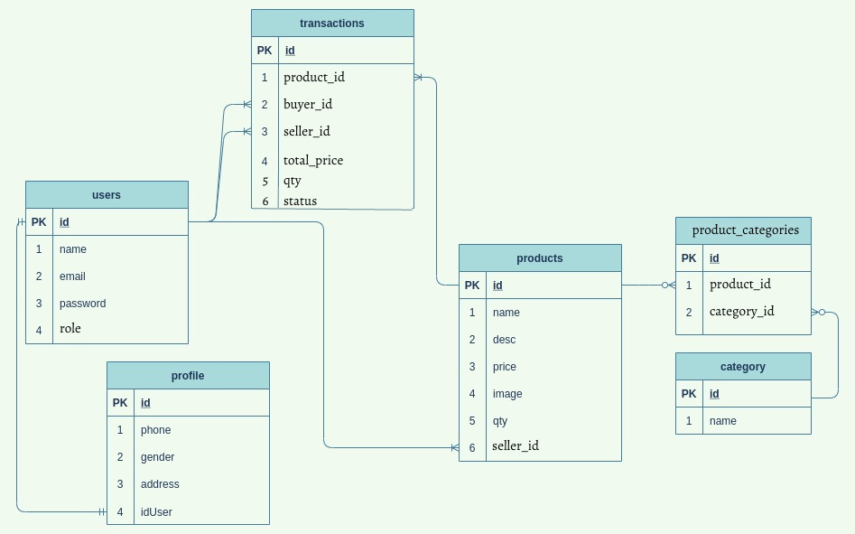
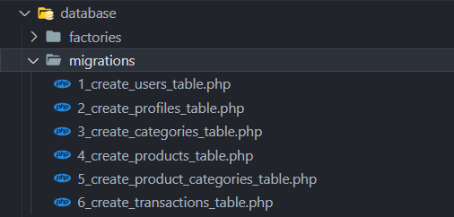

# Database Preparation for Relation

## Database Design



## Models

### Prepare

-   Run this in your terminal (like previously we learn) :

```bash
php artisan make:model -mcfs User
```

```bash
php artisan make:model -mcfs Profile
```

```bash
php artisan make:model -mcfs Category
```

```bash
php artisan make:model -mcfs Product
```

```bash
php artisan make:model -mcfs ProductCategory
```

```bash
php artisan make:model -mcfs Transaction
```

-   Or, if you same with me, not make model sequentially while making this template (😂), you must arrange it manually by renaming the migration file like so :



-   So it's basically migrating from 1 to 6 (users -> profiles -> categories -> products -> product_categories -> transactions)
-   Why should I migrate it sequentially? This is your homework. Please find out for yourself, hehe 😄

## Creating migration schema

### User schema

-   Open your `1_create_users_table.php`, modify code like this :

    > File : database/migrations/1_create_users_table.php

    ```php
    public function up()
    {
        Schema::create('users', function (Blueprint $table) {
            $table->id();
            $table->string("name");
            $table->string("email")->unique();
            $table->string("password");
            $table->string('role');
            $table->timestamps();
        });
    }
    ```

### Profile schema

-   Open your `2_create_profiles_table.php`, modify code like this :

    > File : database/migrations/2_create_profiles_table.php

    ```php
    public function up()
    {
        Schema::create('profiles', function (Blueprint $table) {
            $table->id();
            $table->string('phone');
            $table->string('gender');
            $table->string('address');
            $table->unsignedBigInteger('user_id');
            $table->timestamps();

            $table->foreign('user_id')->references('id')->on('users')->onDelete('cascade')->onUpdate('cascade');
        });
    }
    ```

### Category schema

-   Open your `3_create_categories_table.php`, modify code like this :

    > File : database/migrations/3_create_categories_table.php

    ```php
    public function up()
    {
        Schema::create('categories', function (Blueprint $table) {
            $table->id();
            $table->string('name');
            $table->timestamps();
        });
    }
    ```

### Product schema

-   Open your `4_create_products_table.php`, modify code like this :

    > File : database/migrations/4_create_products_table.php

    ```php
    public function up()
    {
        Schema::create('products', function (Blueprint $table) {
            $table->id();
            $table->string('name');
            $table->text('desc');
            $table->unsignedBigInteger('price');
            $table->string('image');
            $table->integer('qty')->default(0);
            $table->unsignedBigInteger('seller_id');
            $table->timestamps();

            $table->foreign('seller_id')->references('id')->on('users')->onDelete('cascade')->onUpdate('cascade');
        });
    }
    ```

### ProductCategory schema

-   Open your `5_create_product_categories_table.php`, modify code like this :

    > File : database/migrations/5_create_product_categories_table.php

    ```php
    public function up()
    {
        Schema::create('product_categories', function (Blueprint $table) {
            $table->id();
            $table->unsignedBigInteger('product_id');
            $table->unsignedBigInteger('category_id');
            $table->timestamps();

            $table->foreign('product_id')->references('id')->on('products')->onDelete('cascade')->onUpdate('cascade');
            $table->foreign('category_id')->references('id')->on('categories')->onDelete('cascade')->onUpdate('cascade');
        });
    }
    ```

### Transaction schema

-   Open your `6_create_transactions_table.php`, modify code like this :

    > File : database/migrations/6_create_transactions_table.php

    ```php
    public function up()
    {
        Schema::create('transactions', function (Blueprint $table) {
            $table->id();
            $table->unsignedBigInteger('product_id');
            $table->unsignedBigInteger('buyer_id');
            $table->unsignedBigInteger('seller_id');
            $table->unsignedBigInteger('total_price');
            $table->unsignedInteger('qty');
            $table->string('status');
            $table->timestamps();

            $table->foreign('product_id')->references('id')->on('products')->onDelete('cascade')->onUpdate('cascade');
            $table->foreign('buyer_id')->references('id')->on('users')->onDelete('cascade')->onUpdate('cascade');
            $table->foreign('seller_id')->references('id')->on('users')->onDelete('cascade')->onUpdate('cascade');
        });
    }
    ```

## Creating factory and seeders

-   If you are still in the development stage, it is recommended to create your `factories` and `seeders` first. This will make things easier for you in the future and prevent headaches later on 😁

### Creating factory

#### User factory

-   Import this :

> File : app/database/factories/UserFactory.php

```php
use Illuminate\Support\Facades\Hash;
```

-   And, write this :

> File : app/database/factories/UserFactory.php

```php
public function definition()
{
    return [
        'name' => fake()->name(),
        'email' => fake()->unique()->safeEmail(),
        'password' => Hash::make(fake()->unique()->password()),
        'role' => fake()->randomElement(["admin", "member"]),
    ];
}
```

#### Profile factory

-   Import this :

> File : app/database/factories/ProfileFactory.php

```php
use App\Models\User;
```

-   And, write this :

> File : app/database/factories/ProfileFactory.php

```php
public function definition()
{
    return [
        'phone' => fake()->phoneNumber(),
        'gender' => fake()->randomElement(['male', 'female']),
        'address' => fake()->address(),
        'user_id' => User::factory()
    ];
}
```

#### Category factory

> File : app/database/factories/CategoryFactory.php

```php
public function definition()
{
    return [
        'name' => fake()->word(),
    ];
}
```

#### Product factory

-   Import this :

> File : app/database/factories/ProductFactory.php

```php
use App\Models\User;
```

-   And, write this :

> File : app/database/factories/ProductFactory.php

```php
public function definition()
{
    $seller_ids = User::pluck('id');

    $seller_id = $this->faker->randomElement($seller_ids);

    $user = User::find($seller_id);
    $is_admin = $user->role == 'admin';

    while (!$is_admin) {
        $seller_id = $this->faker->randomElement($seller_ids);
        $user = User::find($seller_id);
        $is_admin = $user->role == 'admin';
    }

    return [
        'name' => fake()->name(),
        'desc' => fake()->text(),
        'price' => fake()->numberBetween(1000, 500000),
        'image' => fake()->imageUrl(),
        'qty' => fake()->numberBetween(0, 1000),
        'seller_id' => $seller_id,
    ];
}
```

#### ProductCategory factory

-   Import this :

> File : app/database/factories/ProductCategoryFactory.php

```php
use App\Models\Category;
use App\Models\Product;
```

-   And, write this :

> File : app/database/factories/ProductCategoryFactory.php

```php
public function definition()
{
    $product_ids = Product::pluck('id');
    $category_ids = Category::pluck('id');

    return [
        'product_id' => fake()->randomElement($product_ids),
        'category_id' => fake()->randomElement($category_ids)
    ];
}
```

#### Transaction factory

-   Import this :

> File : app/database/factories/TransactionFactory.php

```php
use App\Models\Product;
use App\Models\User;
```

-   And, write this :

> File : app/database/factories/TransactionFactory.php

```php
public function definition()
{
    $product_ids = Product::pluck('id');
    $buyer_ids = User::pluck('id');

    $product_id = fake()->randomElement($product_ids);
    $buyer_id = fake()->randomElement($buyer_ids);

    $product = Product::find($product_id);
    $price = $product->price;
    $seller_id = $product->seller_id;

    $qty = fake()->numberBetween(1, 50);
    $total_price = $price * $qty;

    return [
        "product_id" => $product_id,
        "buyer_id" => $buyer_id,
        "seller_id" => $seller_id,
        "total_price" => $total_price,
        "qty" => $qty,
        "status" => fake()->randomElement(["pending", "success", "failed"]),
    ];
}
```

### Creating seeders

#### Database seeder

> File : app/database/factories/DatabaseSeeder.php

```php
public function run()
{
    $this->call(ProfileSeeder::class);
    $this->call(CategorySeeder::class);
    $this->call(ProductSeeder::class);
    $this->call(ProductCategorySeeder::class);
    $this->call(TransactionSeeder::class);
}
```

-   Notice there is no `UserSeeder` here, because if you back to `ProfileFactory.php`, `UserFactory` is already called like so :

```php
'user_id' => User::factory()
```

-   It's mean's that while creating profile, we actually creating users too and attach the id to `user_id`
-   So, we don't need to modify `UserSeeder.php` later.
-   Take your time to understand it, hehe 😁

#### Profile seeder

> File : app/database/factories/ProfileFactory.php

```php
public function run()
{
    \App\Models\Profile::factory()->count(5)->create();
}
```

#### Category seeder

> File : app/database/factories/CategoryFactory.php

```php
public function run()
{
    \App\Models\Category::factory(5)->create();
}
```

#### Product seeder

> File : app/database/factories/ProductSeeder.php

```php
public function run()
{
    \App\Models\Product::factory(10)->create();
}
```

#### ProductCategory seeder

> File : app/database/factories/ProductCategorySeeder.php

```php
public function run()
{
    \App\Models\ProductCategory::factory()->count(5)->create();
}
```

#### Transaction seeder

> File : app/database/factories/TransactionSeeder.php

```php
public function run()
{
    \App\Models\Transaction::factory()->count(5)->create();
}
```

## Let's try to migrate it (also with seeders)

Run this in terminal :

```bash
php artisan migrate:fresh --seed
```

-   **Warning** : remember, `migrate:fresh` means that all of your table will be deleted and created again.
-   `--seed` means that we want to use the seeder that we have created previously.

## Database result

-   Now, check your databases, it should appear with the fake data like so :

    

-   Beautiful! I really love to do this kind of stuff when i'm working for this template, just for you guys, haha 🔥😂

## Data Transfer Object (DTO)

-   Let's add some new DTO to our project
-   Create `Auth` folder, inside it Create `AuthRequest.php` and write this below code :

> File: `app/DTO/Request/Auth/AuthRequest.php`

```php
<?php

namespace App\DTO\Request\Auth;

use Illuminate\Support\Facades\Validator;

class AuthRequest
{
    public string $name;
    public string $email;
    public string $password;

    public function __construct(array $user)
    {
        $this->name = $user["name"] ?? "";
        $this->email = $user["email"] ?? "";
        $this->password = $user["password"] ?? "";
    }

    public function validate(): array
    {
        $validator = Validator::make([
            'name' => $this->name,
            'email' => $this->email,
            'password' => $this->password,
        ], [
            'name' => ['required', 'string', 'max:255'],
            'email' => ['required', 'email', 'unique:users,email'],
            'password' => ['required', 'string', 'min:4'],
        ]);

        if ($validator->fails()) {
            $errors = $validator->errors()->toArray();
            return [
                'error' => $errors,
            ];
        }

        return [];
    }
}
```

-   Create `Product` folder, inside it Create `ProductRequest.php` and write this below code :

> File: `app/DTO/Request/Product/ProductRequest.php`

```php
<?php

namespace App\DTO\Request\Product;

use Illuminate\Support\Facades\Validator;

class ProductRequest
{
    public string $name;
    public string $desc;
    public int $price;
    public string $image;
    public int $qty;
    public int $seller_id;
    public array $category_id;

    public function __construct(array $user)
    {
        $this->name = $user["name"] ?? "";
        $this->desc = $user["desc"] ?? "";
        $this->price = $user["price"] ?? 0;
        $this->image = $user["image"] ?? "";
        $this->qty = $user["qty"] ?? 0;
        $this->seller_id = $user["seller_id"] ?? 0;
        $this->category_id = $user["category_id"] ?? [];
    }

    public function validate(): array
    {
        $validator = Validator::make([
            'name' => $this->name,
            'desc' => $this->desc,
            'price' => $this->price,
            'image' => $this->image,
            'qty' => $this->qty,
            'seller_id' => $this->seller_id,
            'category_id' => $this->category_id,
        ], [
            'name' => ['required', 'string', 'max:255'],
            'desc' => ['nullable', 'string'],
            'price' => ['required', 'numeric', 'min:0'],
            'image' => ['nullable', 'string'],
            'qty' => ['required', 'integer', 'min:1'],
            'seller_id' => ['required', 'integer'],
            'category_id' => ['required', 'array'],
            'category_id.*' => ['integer'], // this rule validates each element of the array
        ]);

        if ($validator->fails()) {
            $errors = $validator->errors()->toArray();
            return [
                'error' => $errors,
            ];
        }

        return [];
    }
}
```

-   Create `Profile` folder, inside it Create `ProfileResponse.php` and write this below code :

> File: `app/DTO/Response/Profile/ProfileResponse.php`

```php
<?php

namespace App\DTO\Request\Profile;

use Illuminate\Support\Facades\Validator;

class ProfileResponse
{
    public int $id;
    public string $phone;
    public string $gender;
    public string $address;
    public int $user_id;

    public function __construct(array $user)
    {
        $this->id = $user["id"] ?? 0;
        $this->phone = $user["phone"] ?? "";
        $this->gender = $user["gender"] ?? "";
        $this->address = $user["address"] ?? "";
        $this->user_id = $user["user_id"] ?? 0;
    }

    public function toArray(): array
    {
        return [
            'id' => $this->id,
            'phone' => $this->phone,
            'gender' => $this->gender,
            'address' => $this->address,
            'user_id' => $this->user_id,
        ];
    }
}
```
